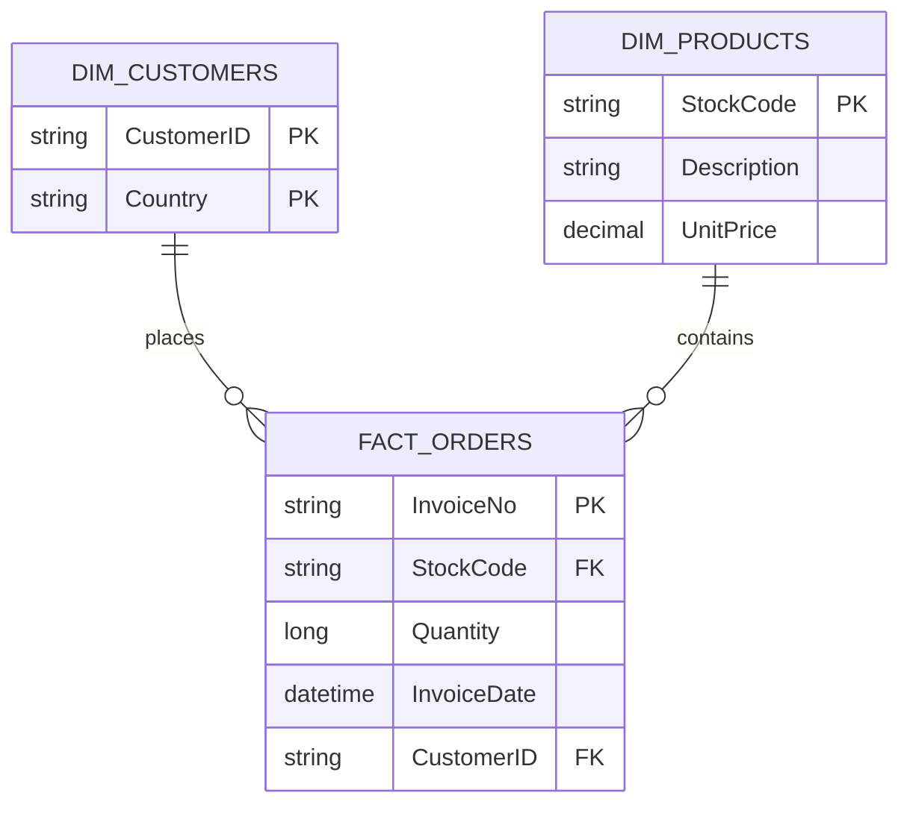

## Requirements
* Java 25
* Poetry

## Running
### Bash:
* `poetry install`
* `poetry run python src/loki/main.py`
### Pycharm:
* Import project.
* Open `src/loki/main.py` and click on green play button at the bottom next to `if __name__ == "__main__":` line
* or click here `main`

## Notes
The code is not production ready. The `print` and `show` statements are left to document the process of thinking and coding.

For production all those statements would be removed. The logic in the _main_ method would be split into more modules.

## Assumptions
* Negative order values are treated as refunds
* Null values found with the help of this snippet:
  ```
  null_df = df_name.where(col("col_name").isNull())
  null_df.show()
  ```
  * Customers table: 
      * CustomerID is nullable
  * Orders table:
      * InvoiceNo and StockCode are strings
  * Products table:
      * StockCode is nullable
      * ProductName is nullable
* Raw layer is about getting data from source systems (csv) and storing them in the data lake as parquet. Date and batchId are added  as metadata to support tracing.
* Integration Layer - 3NF for stability and ease of processing - has been cleansed on a basic level.
    * Null values are cleansed
    * White characters are replaced with `_` (underscore) character
    * Deduplication on the following columns:
        * Customers table: 
            * No duplicated values for compound key `{CustomterID, Country}`
        * Orders table:
            * No duplicated values. The same customer can have multiple orders on the same invoice with the same product.
        * Products table:
            * Duplicated entries based on `{StockCode}`. They usually have `null` as description, or one word like `check`, `found` as description and often different price. This should be clarified. For integrity, duplicates are dropped.
* Curating layer follows Star Schema.
  * `Customers`, `Orders` and `Products` tables stays in their original and cleansed form to represent entity-centric models. They fit in their current form into Star Schema where `Customers` and `Products` are dimension tables and `Orders` is a fact table (though the dimensions have fairly small amount of attributes here).

## Proposed Data Quality rules.
* No null values in `Customers` table.
* No null values in `Orders` table.
* No null values in `Products` table.
* No duplicated values based on `{StockCode}` in `Products` table.
* Deduplication in `Products` table based on `Description` column.
* Replace white characters with `_` (underscore) character in key columns.
* Unified money value - precision.
* Unified date format.

## Model Diagram



